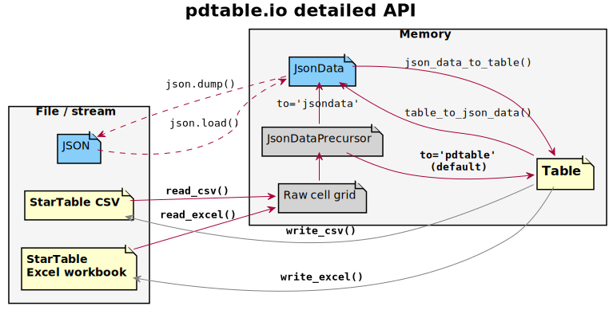

JSON support
============

StarTable data can be converted to and from a ``JsonData`` object i.e. a
JSON-ready data structure of nested dicts (“objects”), lists (“arrays”),
and JSON-native values. This ``JsonData`` can then be serialized and
deserialized directly using the standard library’s ``json.dump()`` and
``json.load()``.

A ``JsonData`` representation is currently only defined for table
blocks.

The pdtable.io API including JSON support can be illustrated as a more
detailed version of the diagram shown earlier:

.. _fig-io-detailed:

   pdtable.io API

In addition, two successive intermediate data structures are visible in
this diagram:

-  “Raw cell grid” is simply a sequence of sequence of values (usually a
   list of lists or list of tuples) interpreted as rows of cells, with
   cell contents as read in their raw form from CSV or Excel.
-  ``JsonDataPrecursor`` is essentially the same thing as ``JsonData``,
   with the exception that it may contain values that are not directly
   consumable by ``json.dump()``. These values must be converted further
   if the aim is a ``JsonData``; for example Numpy arrays to lists,
   ``datetime.datetime`` to a string representation thereof, etc.

Let’s re-read the CSV stream we created earlier, but specifying the
argument ``to='jsondata'`` such that tables should be parsed to JSON
data.

.. code:: ipython3

    csv_data.seek(0)
    block_gen = read_csv(csv_data, to="jsondata")
    json_ready_tables = [b for bt, b in block_gen if bt == BlockType.TABLE]
    
    json_ready_tables[0]

.. parsed-literal::

    {'name': 'places',
     'columns': {'place': {'unit': 'text', 'values': ['home', 'work', 'beach']},
      'distance': {'unit': 'km', 'values': [0.0, 1.0, 2.0]},
      'ETA': {'unit': 'datetime',
       'values': ['2020-08-04 08:00:00',
        '2020-08-04 09:00:00',
        '2020-08-04 17:00:00']},
      'is_hot': {'unit': 'onoff', 'values': [True, False, True]}},
     'destinations': {'all': None}}

This data structure is now easily serialized as JSON:

.. code:: ipython3

    import json
    
    table_json = json.dumps(json_ready_tables[0])
    print(table_json)

.. parsed-literal::

    {"name": "places", "columns": {"place": {"unit": "text", "values": ["home", "work", "beach"]}, "distance": {"unit": "km", "values": [0.0, 1.0, 2.0]}, "ETA": {"unit": "datetime", "values": ["2020-08-04 08:00:00", "2020-08-04 09:00:00", "2020-08-04 17:00:00"]}, "is_hot": {"unit": "onoff", "values": [true, false, true]}}, "destinations": {"all": null}}
    

There are also utilities to convert back and forth between ``JsonData``
and ``Table``.

.. code:: ipython3

    from pdtable.io import json_data_to_table, table_to_json_data
    
    t = json_data_to_table(json_ready_tables[0])
    t  # It's now a Table

.. parsed-literal::

    \*\*places
    all
      place [text]  distance [km]      ETA [datetime]  is_hot [onoff]
    0         home            0.0 2020-08-04 08:00:00            True
    1         work            1.0 2020-08-04 09:00:00           False
    2        beach            2.0 2020-08-04 17:00:00            True

.. code:: ipython3

    table_to_json_data(t)  # Now it's back to JsonData

.. parsed-literal::

    {'name': 'places',
     'destinations': {'all': None},
     'columns': {'place': {'unit': 'text', 'values': ['home', 'work', 'beach']},
      'distance': {'unit': 'km', 'values': [0.0, 1.0, 2.0]},
      'ETA': {'unit': 'datetime',
       'values': ['2020-08-04 08:00:00',
        '2020-08-04 09:00:00',
        '2020-08-04 17:00:00']},
      'is_hot': {'unit': 'onoff', 'values': [True, False, True]}}}

    