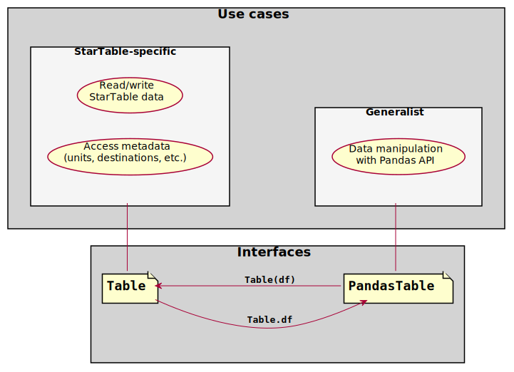
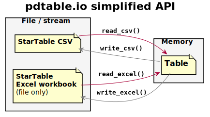

Not-so-quick start
===================================

Apologies for the clickbait.

The ``pdtable`` package allows working with StarTable tables as pandas
dataframes while consistently keeping track of StarTable-specific
metadata such as table destinations and column units.

This is implemented by providing two interfaces to the same backing
object: - ``TableDataFrame`` is derived from ``pandas.DataFrame``. It
carries the data and is the interface of choice for interacting with the
data using the pandas API, with all the convenience that this entails.
It also carries StarTable metadata, but in a less accessible way. -
``Table`` is a stateless façade for a backing ``TableDataFrame`` object.
``Table`` is the interface of choice for convenient access to
StarTable-specific metadata such as column units, and table destinations
and origin. Some data manipulation is also possible in the ``Table``
interface, though this functionality is limited.

   Table interfaces

This page shows code that demonstrates usage. See the ``pdtable``
docstring for a discussion of the implementation.

Idea
----

The central idea is that as much as possible of the table information is
stored as a pandas dataframe, and that the remaining information is
stored as a ``ComplementaryTableInfo`` object attached to the dataframe
as registered metadata. Further, access to the full table datastructure
is provided through a facade object (of class ``Table``). ``Table``
objects have no state (except the underlying decorated dataframe) and
are intended to be created when needed and discarded afterwards:

::

   tdf = make_table_dataframe(...)
   unit_height = Table(tdf).height.unit

Advantages of this approach are that:

1. Code can be written for (and tested with) pandas dataframes and still
   operate on ``TableDataFrame`` objects. This frees client code from
   necessarily being coupled to the startable project. A first layer of
   client code can read and manipulate StarTable data, and then pass it
   on as a (``TableDataFrame``-flavoured) ``pandas.DataFrame`` to a
   further layer having no knowledge of ``pdtable``.
2. The access methods of pandas ``DataFrames``, ``Series``, etc. are
   available for use by consumer code via the ``TableDataFrame``
   interface. This both saves the work of re-implementing similar access
   methods on a StarTable-specific object, and likely allows better
   performance and documentation.

The ``Table`` aspect
--------------------

The table aspect presents the table with a focus on StarTable metadata.
Data manipulation functions exist, and more are easily added – but focus
is on metadata.

.. code:: ipython3

    from pdtable import frame
    from pdtable.proxy import Table

.. code:: ipython3

    t = Table(name="mytable")
    
    # Add columns explicitly...
    t.add_column("places", ["home", "work", "beach", "unicornland"], "text")
    
    # ...or via item access
    t["distance"] = [0, 1, 2, 42]
    
    # Modify column metadata through column proxy objets:
    t["distance"].unit = "km"  # (oops I had forgotten to set distance unit!)
    
    # Table renders as annotated dataframe
    t

.. parsed-literal::

    \*\*mytable
    all
      places [text]  distance [km]
    0          home              0
    1          work              1
    2         beach              2
    3   unicornland             42

.. code:: ipython3

    t.column_names

.. parsed-literal::

    ['places', 'distance']

.. code:: ipython3

    # Each column has associated metadata object that can be manipulated:
    t["places"]

.. parsed-literal::

    Column(name='places', unit='text', values=<PandasArray>
    ['home', 'work', 'beach', 'unicornland']
    Length: 4, dtype: object)

.. code:: ipython3

    t.units

.. parsed-literal::

    ['text', 'km']

.. code:: ipython3

    str(t)

.. parsed-literal::

    '\*\*mytable\\nall\\n  places [text]  distance [km]\\n0          home              0\\n1          work              1\\n2         beach              2\\n3   unicornland             42'

.. code:: ipython3

    t.metadata

.. parsed-literal::

    TableMetadata(name='mytable', destinations={'all'}, operation='Created', parents=[], origin='')

.. code:: ipython3

    # Creating table from pandas dataframe:
    t2 = Table(pd.DataFrame({"c": [1, 2, 3], "d": [4, 5, 6]}), name="table2", units=["m", "kg"])
    t2

.. parsed-literal::

    \*\*table2
    all
       c [m]  d [kg]
    0      1       4
    1      2       5
    2      3       6

The ``TableDataFrame`` aspect
-----------------------------

Both the table contents and metadata displayed and manipulated throught
the ``Table``-class is stored as a ``TableDataFrame`` object, which is a
normal pandas dataframe with two modifications:

-  It has a ``_table_data`` field registered as a metadata field, so
   that pandas will include it in copy operations, etc.
-  It will preserve column and table metadata for some pandas
   operations, and fall back to returning a vanilla ``pandas.DataFrame``
   if this is not possible/implemented.

.. code:: ipython3

    # After getting a reference to the TableDataFrame backing Table t, it is safe to delete t:
    df = t.df
    del t
    # Just construct a new Table facade, and everything is back in place.
    Table(df)

.. parsed-literal::

    \*\*mytable
    all
      places [text]  distance [km]
    0          home              0
    1          work              1
    2         beach              2
    3   unicornland             42

.. code:: ipython3

    # Interacting with table metadata form  without the Table proxy is slightly verbose
    df2 = frame.make_table_dataframe(
        pd.DataFrame({"c": [1, 2, 3], "d": [4, 5, 6]}), name="table2", units=["m", "kg"]
    )

.. code:: ipython3

    # Example: combining columns from multiple tables
    df_combinded = pd.concat([df, df2], sort=False, axis=1)
    Table(df_combinded)

.. parsed-literal::

    \*\*mytable
    all
      places [text]  distance [km]  c [m]  d [kg]
    0          home              0    1.0     4.0
    1          work              1    2.0     5.0
    2         beach              2    3.0     6.0
    3   unicornland             42    NaN     NaN

Fundamental issues with the facade approach
-------------------------------------------

The key problem with not integrating more tightly with the dataframe
datastructure is that some operations will not trigger ``__finalize__``
and thus have to be deciphered based on the dataframe and metadata
states.

One example of this is column names:

.. code:: ipython3

    # Make a table and get its backing df
    tab = Table(pd.DataFrame({"a": [1, 2, 3], "b": [4, 5, 6]}), name="foo", units=["m", "kg"])
    df = tab.df
    # Edit df column names
    df.columns = ["a_new", "b_new"]
    
    # This edit doesn't propagate to the hidden metadata!
    col_names_before_access = list(df._table_data.columns.keys())
    print(f"Metadata columns before update triggered by access:\n{col_names_before_access}\n")
    assert col_names_before_access == ["a", "b"]  # Still the old column names
    
    # ... until the facade is built and the metadata is accessed.
    _ = str(Table(df))  # access it
    col_names_after_access = list(df._table_data.columns.keys())
    print(f"Metadata columns after update:\n{col_names_after_access}\n")
    assert col_names_after_access == ["a_new", "b_new"]  # Now they've updated

.. parsed-literal::

    Metadata columns before update triggered by access:
    ['a', 'b']
    
    Metadata columns after update:
    ['a_new', 'b_new']
    
    

I/O
---

StarTable data can be read from, and written to, CSV files and Excel
workbooks. In its simplest usage, the pdtable.io API can be illustrated
as: |pdtable.io simplified API| We will return to a more detailed
diagram also illustrating JSON support.

Reading
~~~~~~~

The functions ``read_excel()`` and ``read_csv()`` do what it says on the
tin. ``read_csv()`` can read from files as well as text streams.

These generate tuples of (``block_type``, ``block``) where \* ``block``
is a StarTable block \* ``block_type`` is a ``BlockType`` enum that
indicates which type of StarTable block ``block`` is. Possible values:
``DIRECTIVE``, ``TABLE``, ``TEMPLATE_ROW``, ``METADATA``, and ``BLANK``.

Let’s make some CSV StarTable data, put it in a text stream, and read
that stream. (Could just as well have been a CSV file.)

.. code:: ipython3

    from io import StringIO
    from pdtable import read_csv
    
    csv_data = StringIO(
        dedent(
            """\
        author: ;XYODA     ;
        purpose:;Save the galaxy
    
        \*\*\*gunk
        grok
        jiggyjag
    
        \*\*places;
        all
        place;distance;ETA;is_hot
        text;km;datetime;onoff
        home;0.0;2020-08-04 08:00:00;1
        work;1.0;2020-08-04 09:00:00;0
        beach;2.0;2020-08-04 17:00:00;1
    
        \*\*farm_animals;;;
        your_farm my_farm other_farm;;;
        species;n_legs;avg_weight;
        text;-;kg;
        chicken;2;2;
        pig;4;89;
        cow;4;200;
        unicorn;4;NaN;
        """
        )
    )
    
    # Read the stream. Syntax is the same if reading CSV file.
    # Reader function returns a generator; unroll it in a list for convenience.
    block_list = list(read_csv(csv_data))
    assert len(block_list) == 4

The reader generates tuples of ``(BlockType, block)``. Note that
blank/comment lines are read but not parsed.

.. code:: ipython3

    for bt, b in block_list:
        print(bt, type(b))

.. parsed-literal::

    BlockType.METADATA <class 'pdtable.auxiliary.MetadataBlock'>
    BlockType.DIRECTIVE <class 'pdtable.auxiliary.Directive'>
    BlockType.TABLE <class 'pdtable.proxy.Table'>
    BlockType.TABLE <class 'pdtable.proxy.Table'>
    

Here’s one of the tables.

.. code:: ipython3

    t = block_list[2][1]
    assert t.name == "places"
    print(t)

.. parsed-literal::

    \*\*places
    all
      place [text]  distance [km]      ETA [datetime]  is_hot [onoff]
    0         home            0.0 2020-08-04 08:00:00            True
    1         work            1.0 2020-08-04 09:00:00           False
    2        beach            2.0 2020-08-04 17:00:00            True
    

We can pick the tables (and leave out blocks of other types) like this:

.. code:: ipython3

    from pdtable import BlockType
    
    tables = [b for bt, b in block_list if bt == BlockType.TABLE]
    assert len(tables) == 2

Filtered reading
~~~~~~~~~~~~~~~~

Blocks can be filtered prior to parsing, by passing to a callable as
``filter`` argument to the reader functions. This can reduce reading
time substantially when reading only a few tables from an otherwise
large file or stream.

The callable must accept two arguments: block type, and block name. Only
those blocks for which the filter callable returns ``True`` are fully
parsed. Other blocks are parsed only superficially i.e. only the block’s
top-left cell, which is just enough to recognize block type and name to
pass to the filter callable, thus avoiding the much more expensive task
of parsing the entire block, e.g. the values in all columns and rows of
a large table.

Let’s design a filter that only accepts tables whose name contains the
word ``'animal'``.

.. code:: ipython3

    def is_table_about_animals(block_type: BlockType, block_name: str) -> bool:
        return block_type == BlockType.TABLE and "animal" in block_name

Now let’s see what happens when we use this filter when re-reading the
same CSV text stream as before.

.. code:: ipython3

    csv_data.seek(0)
    block_list = list(read_csv(csv_data, filter=is_table_about_animals))
    
    assert len(block_list) == 1
    block_list[0][1]

.. parsed-literal::

    \*\*farm_animals
    my_farm, your_farm, other_farm
      species [text]  n_legs [-]  avg_weight [kg]
    0        chicken         2.0              2.0
    1            pig         4.0             89.0
    2            cow         4.0            200.0
    3        unicorn         4.0              NaN

Non-table blocks were ignored, and so were table blocks that weren’t
animal-related.

Writing
~~~~~~~

Use the aptly named ``write_csv()`` and ``write_excel()``. Note that
``write_csv()`` can write to files as well as to text streams.

Let’s write the tables we read earlier to a text stream.

.. code:: ipython3

    from pdtable import write_csv
    
    with StringIO() as s:
        write_csv(tables, s)
    
        print(s.getvalue())

.. parsed-literal::

    \*\*places;
    all
    place;distance;ETA;is_hot
    text;km;datetime;onoff
    home;0.0;2020-08-04 08:00:00;1
    work;1.0;2020-08-04 09:00:00;0
    beach;2.0;2020-08-04 17:00:00;1
    
    \*\*farm_animals;
    my_farm your_farm other_farm
    species;n_legs;avg_weight
    text;-;kg
    chicken;2.0;2.0
    pig;4.0;89.0
    cow;4.0;200.0
    unicorn;4.0;-
    
    
    

JSON support
~~~~~~~~~~~~

StarTable data can be converted to and from a ``JsonData`` object i.e. a
JSON-ready data structure of nested dicts (“objects”), lists (“arrays”),
and JSON-native values. This ``JsonData`` can then be serialized and
deserialized directly using the standard library’s ``json.dump()`` and
``json.load()``.

A ``JsonData`` representation is currently only defined for table
blocks.

The pdtable.io API including JSON support can be illustrated as a more
detailed version of the diagram shown earlier:

.. figure:: ../diagrams/img/io_detailed/io_detailed.svg
   :alt: pdtable.io API

   pdtable.io API

In addition, two successive intermediate data structures are visible in
this diagram:

-  “Raw cell grid” is simply a sequence of sequence of values (usually a
   list of lists or list of tuples) interpreted as rows of cells, with
   cell contents as read in their raw form from CSV or Excel.
-  ``JsonDataPrecursor`` is essentially the same thing as ``JsonData``,
   with the exception that it may contain values that are not directly
   consumable by ``json.dump()``. These values must be converted further
   if the aim is a ``JsonData``; for example Numpy arrays to lists,
   ``datetime.datetime`` to a string representation thereof, etc.

Let’s re-read the CSV stream we created earlier, but specifying the
argument ``to='jsondata'`` such that tables should be parsed to JSON
data.

.. code:: ipython3

    csv_data.seek(0)
    block_gen = read_csv(csv_data, to="jsondata")
    json_ready_tables = [b for bt, b in block_gen if bt == BlockType.TABLE]
    
    json_ready_tables[0]

.. parsed-literal::

    {'name': 'places',
     'columns': {'place': {'unit': 'text', 'values': ['home', 'work', 'beach']},
      'distance': {'unit': 'km', 'values': [0.0, 1.0, 2.0]},
      'ETA': {'unit': 'datetime',
       'values': ['2020-08-04 08:00:00',
        '2020-08-04 09:00:00',
        '2020-08-04 17:00:00']},
      'is_hot': {'unit': 'onoff', 'values': [True, False, True]}},
     'destinations': {'all': None}}

This data structure is now easily serialized as JSON:

.. code:: ipython3

    import json
    
    table_json = json.dumps(json_ready_tables[0])
    print(table_json)

.. parsed-literal::

    {"name": "places", "columns": {"place": {"unit": "text", "values": ["home", "work", "beach"]}, "distance": {"unit": "km", "values": [0.0, 1.0, 2.0]}, "ETA": {"unit": "datetime", "values": ["2020-08-04 08:00:00", "2020-08-04 09:00:00", "2020-08-04 17:00:00"]}, "is_hot": {"unit": "onoff", "values": [true, false, true]}}, "destinations": {"all": null}}
    

There are also utilities to convert back and forth between ``JsonData``
and ``Table``.

.. code:: ipython3

    from pdtable.io import json_data_to_table, table_to_json_data
    
    t = json_data_to_table(json_ready_tables[0])
    t  # It's now a Table

.. parsed-literal::

    \*\*places
    all
      place [text]  distance [km]      ETA [datetime]  is_hot [onoff]
    0         home            0.0 2020-08-04 08:00:00            True
    1         work            1.0 2020-08-04 09:00:00           False
    2        beach            2.0 2020-08-04 17:00:00            True

.. code:: ipython3

    table_to_json_data(t)  # Now it's back to JsonData

.. parsed-literal::

    {'name': 'places',
     'destinations': {'all': None},
     'columns': {'place': {'unit': 'text', 'values': ['home', 'work', 'beach']},
      'distance': {'unit': 'km', 'values': [0.0, 1.0, 2.0]},
      'ETA': {'unit': 'datetime',
       'values': ['2020-08-04 08:00:00',
        '2020-08-04 09:00:00',
        '2020-08-04 17:00:00']},
      'is_hot': {'unit': 'onoff', 'values': [True, False, True]}}}

Handling directives
~~~~~~~~~~~~~~~~~~~

StarTable Directive blocks are intended to be interpreted and handled at
read time, and then discarded. The client code (i.e. you) is responsible
for doing this. Handling directives is done outside of the ``pdtable``
framework. This would typically done by a function that consumes a
``BlockGenerator`` (the output of the reader functions), processes the
directive blocks encountered therein, and in turn yields a processed
``BlockGenerator``, as in:

::

   def handle_some_directive(bg: BlockGenerator, \*args, \*\*kwargs) -> BlockGenerator:
       ...

Usage would then be:

::

   block_gen = handle_some_directive(read_csv('foo.csv'), args...)

Let’s imagine a directive named ``'include'``, which the client
application is meant to interpret as: include the contents of the listed
StarTable CSV files along with the contents of the file you’re reading
right now. Such a directive could look like:

::

   \*\*\*include
   bar.csv
   baz.csv

Note that there’s nothing magical about the name “include”; it isn’t
StarTable syntax. This name, and how such a directive should be
interpreted, is entirely defined by the application. We could just as
easily imagine a ``rename_tables`` directive requiring certain table
names to be amended upon reading.

But let’s stick to the “include” example for now. The application wants
to interpret the ``include`` directive above as: read two additional
files and throw all the read blocks together. Perhaps even recursively,
i.e. similarly handle any ``include`` directives encountered in
``bar.csv`` and ``baz.csv`` and so on. A handler for this could be
designed to be used as

::

   block_gen = handle_includes(read_csv('foo.csv'), input_dir='./some_dir/', recursive=True)

and look like this:

.. code:: ipython3

    import functools
    from pdtable import BlockIterator, Directive
    
    
    def handle_includes(bg: BlockIterator, input_dir, recursive: bool = False) -> BlockIterator:
        """Handles 'include' directives, optionally recursively.
    
        Handles 'include' directives.
        'include' directives must contain a list of files located in directory 'input_dir'.
    
        Optionally handles 'include' directives recursively. No check is done for circular references.
        For example, if file1.csv includes file2.csv, and file2.csv includes file1.csv, then infinite
        recursion ensues upon reading either file1.csv or file2.csv with 'recursive' set to True.
    
        Args:
            bg:
                A block generator returned by read_csv
    
            input_dir:
                Path of directory in which include files are located.
    
            recursive:
                Handle 'include' directives recursively, i.e. 'include' directives in files themselves
                read as a consequence of an 'include' directive, will be handled. Default is False.
    
        Yields:
            A block generator yielding blocks from...
            * if recursive, the entire tree of files in 'include' directives.
            * if not recursive, the top-level file and those files listed in its 'include' directive (if
              any).
    
        """
    
        deep_handler = (
            functools.partial(handle_includes, input_dir=input_dir, recursive=recursive)
            if recursive
            else lambda x: x
        )
    
        for block_type, block in bg:
            if block_type == BlockType.DIRECTIVE:
                directive: Directive = block
                if directive.name == "include":
                    # Don't emit this directive block; handle it.
                    for filename in directive.lines:
                        yield from deep_handler(read_csv(Path(input_dir) / filename))
                else:
                    yield block_type, block
            else:
                yield block_type, block

This is only an example implementation. You’re welcome to poach it, but
note that no check is done for circular references! E.g. if ``bar.csv``
contains an ``include`` directive pointing to ``foo.csv`` then calling
``handle_includes`` with ``recursive=True`` will result in a stack
overflow. You may want to perform such a check if relevant for your
application.

